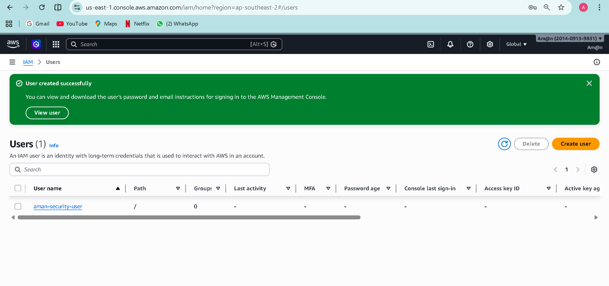
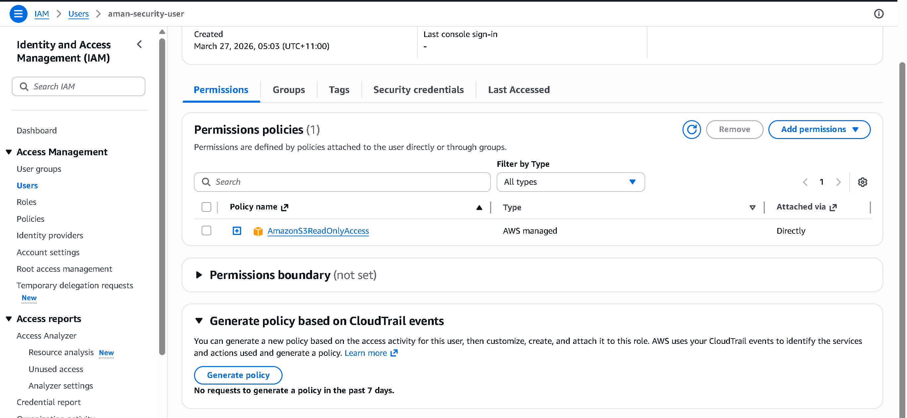

# AWS IAM Security Project

## Project Overview
This project demonstrates how to implement security in AWS using IAM (Identity and Access Management). The goal is to create a secure IAM user and apply limited permissions following best security practices.

## Technologies Used
- AWS IAM
- AWS Management Console

## Implementation Steps
- Created a new IAM user
- Disabled console access for security
- Attached AmazonS3ReadOnlyAccess policy
- Applied least privilege principle
- Verified user permissions

## Key Security Concepts
- Avoided using root account
- Implemented least privilege access
- Used AWS managed policies
- Restricted unnecessary permissions

## 📸 Screenshots

### Users List

### User Details

### Permissions

## Why This Project Matters
IAM is a core AWS security service. This project shows how to control access and protect resources by assigning limited permissions to users.

## Author
Aman Nasir
